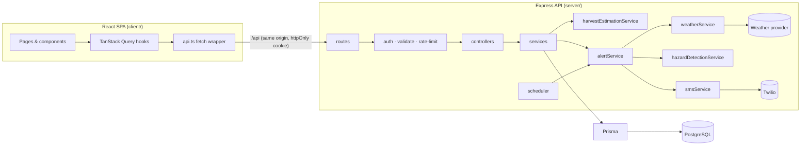
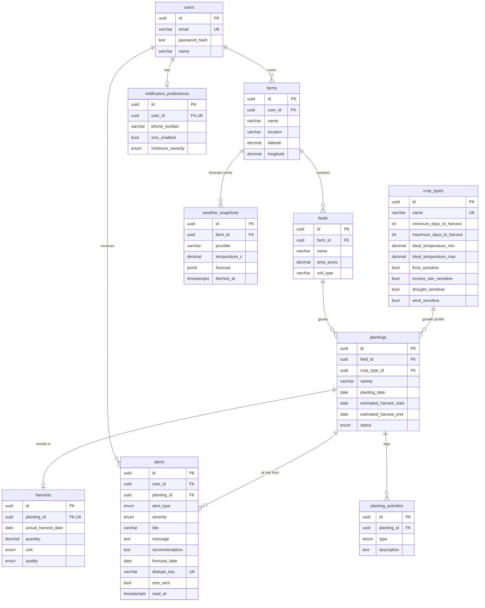

# HarvestTrack

**Crop lifecycle tracking, harvest forecasting and weather-risk alerts for growers.**

HarvestTrack is a full-stack agricultural operations platform. Farmers record what they planted, where and when; the system estimates a harvest window from each crop's typical growing range, monitors the local weather forecast, compares it against the crop's sensitivities, raises alerts for hazards such as frost or heavy rain, optionally texts the farmer, and keeps a season-by-season record of actual harvests.

```
Record planting → Estimate harvest window → Monitor forecast → Detect hazards → Alert (+ SMS) → Record harvest
```

> Harvest dates and weather alerts are **estimates and informational guidance**, never guarantees. The UI labels them that way throughout.

---

## Contents

- [Features](#features)
- [Tech stack](#tech-stack)
- [Architecture](#architecture)
- [Database schema](#database-schema)
- [Quick start (Docker)](#quick-start-docker)
- [Local development (without Docker)](#local-development-without-docker)
- [Environment variables](#environment-variables)
- [How harvest estimation works](#how-harvest-estimation-works)
- [How weather alerts work](#how-weather-alerts-work)
- [How SMS works](#how-sms-works)
- [REST API](#rest-api)
- [Testing](#testing)
- [Project structure](#project-structure)
- [Security](#security)
- [Design system](#design-system)
- [Legacy CLI](#legacy-cli)

---

## Features

| Area | What it does |
|---|---|
| **Farms & fields** | A user owns farms (geocoded from "City, Region" or entered as coordinates); farms contain fields with area and soil type. |
| **Plantings** | Crop (from a data-driven catalogue of 15 crops), variety, planting date, field, location within the field and notes. A new field can be created inline from the planting form. |
| **Estimated Harvest Window** | `planting_date + min days` → `planting_date + max days`, calculated and stored on creation and recalculated when the crop or date changes. |
| **Harvest readiness** | Percentage of the expected growing period that has elapsed, mapped to the stages *Early Growth → Mid Growth → Harvest Approaching → Estimated Harvest Window → Past Estimated Window*. |
| **Status badges** | Growing · Harvest Soon · Ready to Harvest · At Risk · Harvested · Failed, derived server-side from lifecycle, progress and active weather risk. |
| **Weather** | Current temperature, condition, humidity, rain probability, wind and a 7-day forecast per farm, with temperature and rainfall charts. |
| **Hazard detection** | Server-side rules for frost, extreme heat, heavy rain, strong wind and dry spells, evaluated against each crop's sensitivity profile. Severity is LOW, MODERATE or HIGH. |
| **Alerts** | Stored in PostgreSQL with de-duplication, escalation and read state; shown on the dashboard, the crop page and the Alerts page. |
| **SMS** | Opt-in per user, with phone validation and a minimum-severity threshold. Sent via Twilio, or logged when no credentials are configured. |
| **Harvest recording** | Actual date, quantity, unit (kg, lb, tons, bushels, crates), quality and notes. Marks the planting *Harvested*. |
| **Harvest history** | Per-season table and stats, including average timing against the estimated window. |
| **Activity history** | An automatic log (planted, updated, alert raised, harvested) plus free-text field notes. |
| **Auth** | Register, login and logout. bcrypt-hashed passwords; JWT in an httpOnly cookie; every query scoped to the signed-in user. |
| **UX** | Dark mode, responsive layout (tables become cards on mobile), skeleton/empty/error states and accessible forms. |

## Tech stack

**Frontend:** React 19, TypeScript, Vite, Tailwind CSS v4, React Router 7, TanStack Query, Recharts, lucide-react
**Backend:** Node.js 22, Express 5, TypeScript, Prisma ORM, Zod validation, bcrypt, JWT, Helmet, express-rate-limit
**Database:** PostgreSQL 17
**Integrations:** Open-Meteo (default, keyless) or OpenWeatherMap for weather and geocoding; Twilio for SMS
**Tooling:** Vitest + Supertest, Docker / Docker Compose, nginx, npm workspaces

## Architecture



The backend is layered so each part has one job:

- **routes/** map URLs to middleware and controllers.
- **middleware/** handles authentication (`requireAuth`), Zod validation and centralised error handling.
- **controllers/** stay thin: they read the request, call a service and shape the response.
- **services/** hold the business logic:
  - `harvestEstimationService` and `hazardDetectionService` are **pure functions** with no I/O, which makes them trivially unit-testable.
  - `weatherService` fetches forecasts through a provider interface (Open-Meteo, OpenWeatherMap or mock) and caches them in `weather_snapshots`.
  - `alertService` orchestrates the pipeline (weather → hazards → persist → notify).
  - `smsService` wraps a provider interface (Twilio or console).
  - `plantingPresenter` turns database rows into API DTOs with the computed progress, status and risk.

## Database schema



Every table has `created_at` / `updated_at` and UUID primary keys. Foreign keys cascade from users downward, except `crop_types`, which is `RESTRICT` so catalogue rows can't be deleted out from under plantings.

Unique constraints:
- farm names are unique per user, and field names are unique per farm;
- each planting has at most one harvest;
- `alerts.dedupe_key` prevents duplicate alerts.

Indexes cover every foreign key plus the hot query paths: `(status, estimated_harvest_start)`, `(user_id, created_at DESC)`, `(user_id, read_at)` and `(farm_id, fetched_at DESC)`. The schema lives in [`server/prisma/schema.prisma`](server/prisma/schema.prisma), with SQL migrations in `server/prisma/migrations/`.

---

## Quick start (Docker)

The whole stack (PostgreSQL, the API and the web client) runs with Docker Compose.

### Prerequisites

- Docker Desktop 4.x (or Docker Engine 24+ with the Compose v2 plugin)
- About 1.5 GB of free disk space for images

### Start

```bash
cp .env.example .env
# Edit .env — at minimum set POSTGRES_PASSWORD and JWT_SECRET:
#   openssl rand -hex 16   → POSTGRES_PASSWORD
#   openssl rand -hex 32   → JWT_SECRET

docker compose up --build
```

Then open **http://localhost:8080**. On first start the database is empty, so a demo account is created:
**demo@harvesttrack.app / HarvestDemo1** (turn this off with `SEED_DEMO_DATA=false`).

### Services

| Service | Image | Role | Exposed |
|---|---|---|---|
| `postgres` | `postgres:17-alpine` | Database, data in named volume `harvesttrack_postgres_data`. Health check: `pg_isready`. | `127.0.0.1:5434` (for GUI tools) |
| `backend` | `server/Dockerfile` | Express API. Starts only after Postgres is healthy; runs migrations on boot. Health check: `GET /api/health`. | internal `4100` only |
| `frontend` | `client/Dockerfile` | nginx serving the built SPA and reverse-proxying `/api` → `backend:4100`. Starts after the backend is healthy. | `8080` |

Containers talk over the Compose network by **service name**: the API's `DATABASE_URL` points at `postgres:5432`, and nginx proxies to `backend:4100`. Nothing inside the containers uses `localhost` to reach another service.

### Why the frontend is served by nginx (multi-stage build)

The client image builds the React app in a Node stage, then copies only the static `dist/` into `nginx:alpine`. That keeps the runtime image small (no Node, no source, no `node_modules`). Because nginx also proxies `/api`, the browser sees a **single origin**, so the httpOnly session cookie works without CORS or cross-site cookie settings. For day-to-day development, use the Vite dev server instead (see below). It has hot reload and the same `/api` proxy.

### What happens when the backend starts

[`server/scripts/docker-entrypoint.sh`](server/scripts/docker-entrypoint.sh):

1. `prisma migrate deploy`, retrying until PostgreSQL accepts connections (`DB_WAIT_ATTEMPTS`, default 30 × 2 s).
2. Upsert the crop catalogue (`seed.ts --catalog-only`). This is idempotent and never touches user data.
3. If `SEED_DEMO_DATA=true`, create the demo account **only when the database has no users** (`seed.ts --if-empty`).
4. Start the API.

Nothing in the startup path resets or deletes existing data.

### Everyday commands

```bash
docker compose up --build          # build images and start everything (add -d to detach)
docker compose down                # stop and remove containers — data volume is kept
docker compose ps                  # status + health of each service
docker compose logs -f             # follow all logs
docker compose logs -f backend     # follow one service
docker compose build --no-cache backend && docker compose up -d backend   # rebuild one service
docker compose restart backend
```

**Database:**

```bash
# Open a psql shell inside the Postgres container
docker compose exec postgres sh -c 'psql -U "$POSTGRES_USER" -d "$POSTGRES_DB"'

# Apply pending migrations (also runs automatically on backend start)
docker compose exec backend npx prisma migrate deploy

# Seed: crop catalogue only (safe, idempotent)
docker compose exec backend npx tsx prisma/seed.ts --catalog-only
# Seed: demo account only if no users exist
docker compose exec backend npx tsx prisma/seed.ts --if-empty
# Seed: (re)create the demo account — replaces ONLY the demo user's data
docker compose exec backend npx prisma db seed

# Run a hazard scan for all farms right now
docker compose exec backend npx tsx scripts/scan-alerts.ts

# Back up / restore
docker compose exec postgres sh -c 'pg_dump -U "$POSTGRES_USER" "$POSTGRES_DB"' > backup.sql
docker compose exec -T postgres sh -c 'psql -U "$POSTGRES_USER" -d "$POSTGRES_DB"' < backup.sql
```

### Data persistence

PostgreSQL stores its files in the named volume **`harvesttrack_postgres_data`**, not in the source tree. It survives `docker compose down`, rebuilds and restarts. To deliberately wipe everything and start fresh:

```bash
docker compose down -v      # ⚠️ -v deletes the database volume
```

### Environment variables in Docker

Compose reads the root **`.env`** (copied from [`.env.example`](.env.example)) and passes values into the containers. `docker-compose.yml` builds `DATABASE_URL` from `POSTGRES_USER`, `POSTGRES_PASSWORD` and `POSTGRES_DB`. It refuses to start if `POSTGRES_PASSWORD` or `JWT_SECRET` is missing. `.env` is git-ignored and excluded from images by `.dockerignore`, so secrets never end up in source control or image layers.

---

## Local development (without Docker)

Requirements: **Node.js 20+** and PostgreSQL. A local PostgreSQL install isn't required, because the repo can run one for you.

```bash
npm install

# 1. Database — any PostgreSQL works. Zero-install option (real PostgreSQL via embedded binaries, data in server/.pgdata):
npm run db:local              # leave running in its own terminal (port 5433)

# 2. Configure the API
cp server/.env.example server/.env    # set JWT_SECRET; DATABASE_URL already matches db:local

# 3. Create tables + seed the crop catalogue and demo account
npm run db:setup

# 4. Run API (http://localhost:4100) and client (http://localhost:5180) together
npm run dev
```

| Script | Description |
|---|---|
| `npm run dev` | API (tsx watch) and Vite dev server together |
| `npm run build` | Compile the API and build the client |
| `npm test` | Unit and API integration tests |
| `npm run typecheck` | TypeScript checks for both workspaces |
| `npm run db:local` | Start the embedded local PostgreSQL |
| `npm run db:setup` | `prisma migrate deploy` + seed |
| `npm run db:migrate:dev -w server` | Create a new migration after editing `schema.prisma` |
| `npm run alerts:scan -w server` | One-off hazard scan across all farms |

## Environment variables

| Variable | Used by | Default | Description |
|---|---|---|---|
| `DATABASE_URL` | API | — | PostgreSQL connection string (built automatically in Docker) |
| `POSTGRES_DB` / `POSTGRES_USER` / `POSTGRES_PASSWORD` | Docker | `harvesttrack` / `harvest` / — | Database container credentials |
| `JWT_SECRET` | API | — | Signs session tokens. Use ≥ 32 random bytes. |
| `SESSION_TTL_HOURS` | API | `72` | Session lifetime |
| `COOKIE_SECURE` | API | `true` in production | Set `false` when serving over plain HTTP (local Docker) |
| `WEATHER_PROVIDER` | API | `open-meteo` | `open-meteo`, `openweathermap` or `mock` |
| `WEATHER_API_KEY` | API | — | Required only for `openweathermap` |
| `WEATHER_CACHE_MINUTES` | API | `30` | Forecast cache lifetime per farm |
| `ALERT_SCAN_INTERVAL_MINUTES` | API | `180` | Background hazard scan interval (`0` disables it) |
| `TWILIO_ACCOUNT_SID` / `TWILIO_AUTH_TOKEN` / `TWILIO_PHONE_NUMBER` | API | — | SMS. If any are blank, messages are logged instead. |
| `SMS_ENABLED` | API | `true` | Master switch for real SMS delivery |
| `SEED_DEMO_DATA` | Docker | `true` | Create the demo account on first start (empty DB only) |
| `FRONTEND_PORT` / `POSTGRES_HOST_PORT` | Docker | `8080` / `5434` | Host ports |

Secrets exist **only on the server**. The client bundle contains no keys; it talks to `/api` only.

---

## How harvest estimation works

`server/src/services/harvestEstimationService.ts`

1. When a planting is created, the service loads the crop's growth profile from `crop_types`.
2. It computes `estimated_harvest_start = planting_date + minimum_days_to_harvest` and `estimated_harvest_end = planting_date + maximum_days_to_harvest`, and stores both on the planting. If the crop or date is edited, the window is recalculated and the change is logged.
3. On every read, `calculateProgress` derives:
   - `daysGrowing`, plus days until the window opens and closes;
   - **readiness %** = days growing ÷ minimum growing days (capped at 100). Example: corn planted Apr 15 with a 100–120-day range has a window of **Jul 24 – Aug 13**. On day 87, readiness is **87%**: "87% of the expected growing period has passed".
   - the **stage**: Early Growth (< 35%), Mid Growth (< 75%), Harvest Approaching, Estimated Harvest Window, or Past Estimated Window.
4. `deriveDisplayStatus` picks the badge. Weather risk takes priority (an active MODERATE or HIGH alert → **At Risk**), then Ready (in or past the window), then Harvest Soon (≤ 14 days before the window), then Growing.

All date maths runs on calendar dates in UTC, so time zones and daylight-saving shifts can't push an estimate by a day. These are calendar estimates only. The UI says so next to every readiness figure.

**Adding a crop:** append an entry to [`server/prisma/data/cropTypes.ts`](server/prisma/data/cropTypes.ts) and run the seed (upsert by name). No code changes are needed.

## How weather alerts work

```
Scheduler (every 3h) / manual "Run hazard check" / new planting
  → weatherService: forecast per farm (cached in weather_snapshots; stale cache served if the provider is down)
  → hazardDetectionService: forecast × each active planting's crop sensitivity
  → alertService: persist (dedupe / escalate) → activity log
  → smsService: one combined SMS per user if enabled and severity ≥ their minimum
```

**Rules** (`server/src/services/hazardDetectionService.ts`) are deliberately conservative heuristics:

| Hazard | LOW | MODERATE | HIGH |
|---|---|---|---|
| **Frost** (daily min) | — | ≤ 2 °C for frost-sensitive crops; ≤ 0 °C for others | ≤ 0 °C for frost-sensitive crops; ≤ −3 °C for any crop |
| **Heat** (daily max) | ≥ crop's ideal max + 4 °C | ≥ 36 °C | ≥ 40 °C |
| **Heavy rain** (daily total) | ≥ 15 mm for rain-sensitive crops | ≥ 25 mm | ≥ 50 mm; ≥ 25 mm for rain-sensitive crops |
| **Strong wind** (gusts) | ≥ 45 km/h for wind-sensitive crops | ≥ 60 km/h | ≥ 90 km/h; one level higher for wind-sensitive crops |
| **Dry spell** (forecast window) | ≤ 3 mm total and average highs ≥ 28 °C | same, for drought-sensitive crops | same with average highs ≥ 33 °C, for drought-sensitive crops |

For each hazard type, the engine reports the **first** triggering day with the **worst** severity in that run of consecutive days. Keeping the first date stable means the de-duplication key (`planting:type:date`) catches repeat scans. If a later scan finds higher severity, the alert is **escalated**: its content is updated and it's marked unread again.

Each alert includes a message, the possible impact and a recommended action, and is presented as informational guidance.

**Weather providers:**
- **Open-Meteo** is the default. It needs no API key and also handles geocoding.
- **OpenWeatherMap** is used when `WEATHER_PROVIDER=openweathermap` and `WEATHER_API_KEY` is set; its 5-day / 3-hour forecast is aggregated into daily values.
- **mock** is deterministic and offline, for demos and tests. It includes a heavy-rain day and a cold night.

## How SMS works

`server/src/services/smsService.ts`:
- Farmers opt in under **Settings**. They provide a phone number (normalised and validated as E.164), toggle SMS on and choose a minimum severity.
- SMS can't be enabled without a valid number; both the client and the server enforce this.
- After a scan, each user's new or escalated alerts that meet their threshold are combined into **one** message, limiting texts per scan:
  ```
  HarvestTrack Alert:
  Possible frost tomorrow for South Field (low -1.5°C). Potato may be at risk.
  Open HarvestTrack for details.
  ```
- `TwilioSmsProvider` calls Twilio's REST API from the backend. If the Twilio variables are blank (or `SMS_ENABLED=false`), `ConsoleSmsProvider` logs the message instead and the app carries on normally.
- SMS failures are logged and never break alert creation.
- **Settings → Send test message** checks the configuration end to end.

## REST API

All endpoints are under `/api`. Everything except auth and health requires a session cookie (or `Authorization: Bearer <jwt>`). Errors share one shape: `{ "error": { "code", "message", "details?" } }`.

| Method | Path | Description |
|---|---|---|
| GET | `/health` | Liveness + DB connectivity → `{ status, database }` |
| POST | `/auth/register` · `/auth/login` · `/auth/logout` | Session management (rate-limited) |
| GET | `/auth/me` | Current user |
| GET | `/crop-types` | Crop knowledge catalogue |
| GET / POST | `/farms` | List (with fields) / create (geocodes the location) |
| PUT / DELETE | `/farms/:id` | Update / delete |
| GET / POST | `/fields` | List (`?farmId=`) / create |
| PUT / DELETE | `/fields/:id` | Update / delete |
| GET / POST | `/plantings` | List (`?status=ACTIVE\|HARVESTED\|FAILED\|ALL`) / create with estimate |
| GET / PUT / DELETE | `/plantings/:id` | Detail (incl. activity) / update (re-estimates) / delete |
| POST | `/plantings/:id/activities` | Add a field note |
| POST | `/plantings/:id/harvest` | Record a harvest → status *Harvested* |
| GET | `/harvests` | Harvest history (`?season=2026`) + stats |
| GET | `/weather` | Forecast (`?farmId=`, `?refresh=true`) |
| GET | `/alerts` | List (`?severity=`, `?unread=true`, `?plantingId=`) |
| PATCH | `/alerts/:id/read` · `/alerts/read-all` | Mark read |
| POST | `/alerts/scan` | Run the hazard pipeline for the current user |
| GET | `/dashboard/summary` | KPIs, plantings, upcoming harvests, field status, charts |
| GET / PUT | `/settings/notifications` | SMS preferences |
| POST | `/settings/notifications/test` | Send a test SMS |
| PUT | `/settings/profile` | Update display name |

## Testing

```bash
npm test     # 44 tests: 25 unit (estimation + hazard rules) and 19 API integration tests
```

- **Unit tests** cover the spec example (Apr 15 + 100–120 days → Jul 24 – Aug 13), stage boundaries, DST safety, status precedence, every hazard rule and severity grade, run aggregation and ordering.
- **API integration tests** run against a real PostgreSQL database with the mock weather provider and a fake SMS provider. They cover:
  - registration and login (including bcrypt hash storage and duplicate or weak passwords);
  - validation: future or impossible dates, a field from another farm, negative quantities, harvest before planting, phone numbers;
  - **data isolation**: user B gets 404 for every one of user A's records;
  - estimate recalculation;
  - the full scan → alert → SMS → de-duplication pipeline;
  - harvest recording, history and dashboard totals.

## Project structure

```
HarvestTrack/
├── docker-compose.yml        # postgres + backend + frontend
├── .env.example              # Docker configuration template
├── client/                   # React SPA
│   ├── Dockerfile            # Node build → nginx runtime
│   ├── nginx/                # SPA + /api reverse-proxy config template
│   └── src/
│       ├── components/       # brand, layout, ui primitives, crops, weather, alerts, charts
│       ├── pages/            # Landing, Auth, Dashboard, Crops, NewPlanting, PlantingDetail, Farms,
│       │                     # HarvestHistory, Alerts, Weather, Settings
│       ├── hooks/            # TanStack Query hooks, auth & theme contexts
│       ├── services/         # API client
│       ├── lib/              # formatting & domain labels
│       └── types/
├── server/                   # Express API
│   ├── Dockerfile            # multi-stage: build → prod deps → runtime (non-root)
│   ├── prisma/               # schema, migrations, crop catalogue, seed
│   ├── scripts/              # docker-entrypoint, local-db, scan-alerts
│   ├── src/
│   │   ├── config/           # validated environment
│   │   ├── controllers/
│   │   ├── database/         # Prisma client
│   │   ├── middleware/       # auth, validation, error handling
│   │   ├── routes/
│   │   ├── services/         # estimation, hazards, weather/, sms/, alerts, plantings, …
│   │   ├── utils/
│   │   └── validators/       # Zod schemas
│   └── tests/
└── legacy/                   # original MongoDB CLI MVP (kept for reference)
```

## Security

- **Passwords:** bcrypt (cost 12). Login runs a dummy hash compare for unknown emails so response timing doesn't reveal which accounts exist.
- **Sessions:** JWT in an `httpOnly`, `SameSite=Lax` cookie (`Secure` behind HTTPS), with expired sessions reported distinctly so the UI can explain them.
- **Authorization:** every query is scoped by `userId` through the farm → field → planting chain. Records belonging to someone else return **404**, so their existence isn't revealed.
- **Input validation:** Zod on every body, query and param, mirrored by client-side validation for UX.
- **Query safety:** Prisma's parameterised queries; the two raw SQL statements use tagged-template parameters.
- **HTTP hardening:** Helmet headers, a 100 kB body limit, CORS restricted to the client origin, and rate limits on auth, scans and test SMS.
- **Error handling:** a centralised error handler. Internals are logged server-side and never sent to clients.
- **Secrets:** environment variables only; validated at startup; never shipped to the browser, committed or baked into images.

## Design system

HarvestTrack is designed to look like a data and operations product rather than a "green leaf" farm site:

- **Surfaces:** a charcoal sidebar on warm ivory backgrounds, with ivory/sand cards. Hierarchy comes from thin borders rather than heavy shadows.
- **Semantic status colours:**

  | Status | Colour |
  |---|---|
  | Growing | slate blue |
  | Harvest Soon | amber |
  | Ready | gold |
  | At Risk | terracotta |
  | Critical | red |
  | Harvested | muted sage |
  | Inactive | gray |

  Every badge pairs its colour with an icon and a text label, so severity never relies on colour alone.
- **Tokens:** CSS variables mapped into Tailwind (`bg-surface`, `text-ink-2`, …), so dark mode is a token swap. Text tokens meet WCAG AA (≥ 4.5:1) on their tinted backgrounds in both themes.
- **Charts:** use a categorical palette (slate blue, terracotta, violet, amber, sage) checked for colour-blind separation and contrast in light and dark modes. They have one y-axis, recessive grids, tooltips and screen-reader captions.
- **Wordmark:** two crop rows form an **H**, joined by an amber horizon line (the harvest point on a growth timeline).

## Legacy CLI

The original MongoDB-based command-line MVP is preserved in [`legacy/`](legacy/) (run it with `npm i --no-save mongoose dotenv && npm run legacy:cli`; it requires `MONGODB_URI`). Its fixed-duration harvest calculation and "harvest within a week" reminder were the starting point for `harvestEstimationService` and the Harvest Soon status. Migration from MongoDB was a clean replacement rather than a data migration: the legacy records (crop type, location and dates, no users) map onto plantings but have no owner, farm or field to attach to.
